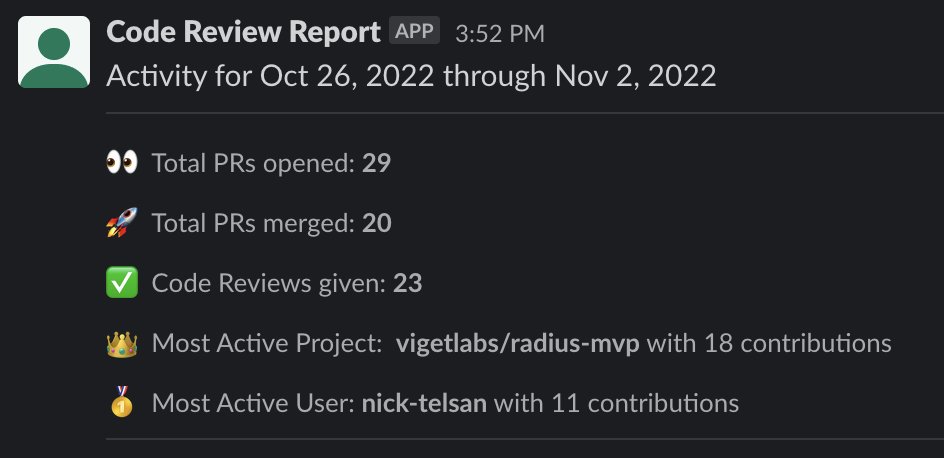
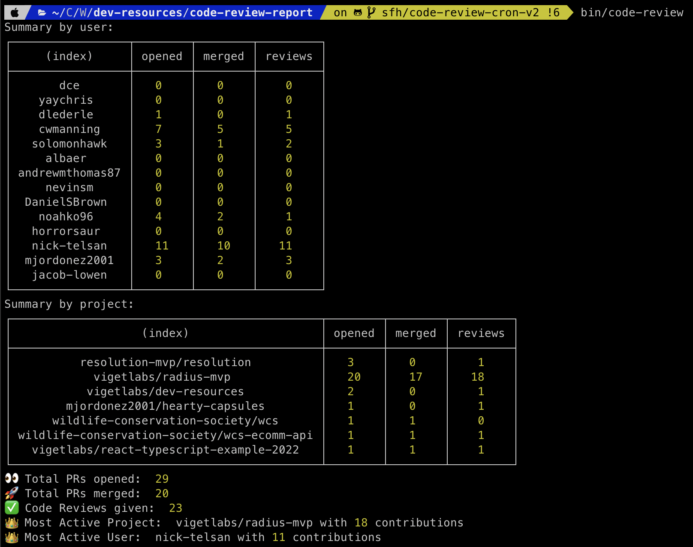

# Code Review Report

This script queries GitHub to report code review statistics for the dev team
over some period of time (defaults to the past week in CI) and records the
results to a [notion database](https://www.notion.so/viget/a93e232d4803490bbc32efa55d56cd5a?v=431090c8a9aa408f95bbc56e34d35c62).

# `bin/code-review`

## Running locally:

You can execute the script locally in order to query for results on-demand and
see a nice print out of some aggregate stats for each team member and project.

The output looks like:

To get up and running locally, you can invoke the `bin/setup` script which will
install the correct version of Node using `asdf` (or prompt you to), create the
`.env` file (and ask you to fill it in), and install npm dependencies.

If you want to query for a longer period of time than the default of 7 days, you
can specify an environment variable `DAYS=n` that determines how many days back
(from today) to query.

To query for a past timeframe you may also specify `WEEKS_AGO=n` which will shift
the window back some number of weeks (defaults to 0).

To get debug information about queries and pagination, you can set `DEBUG=true`.

## On CI:

The script is invoked in a weekly scheduled GitHub Action (`.github/workflows/code-review.yml`)
and requires a few environment variables to be configured in the [repo secrets](https://github.com/vigetlabs/dev-resources/settings/secrets/actions) in order to make authenticated requests to GitHub and to post
messages in Slack.

The workflows make use of hierarchical configuration allowing us to specify
a different slack channel to receive the report for testing purposes
(#code-review-report-test) for Pull Requests and Manual Runs (while allowing
the scheduled cron job to send the report to the main dev slack channel
#dev-campfire).

**Note**: The list of usernames to query activity for is enumerated in `./code-review-report/src/usernames.json`.

| Environment Variable | Purpose                                                                                                               |
| -------------------- | --------------------------------------------------------------------------------------------------------------------- |
| `GH_TOKEN`           | a classic GitHub token that has `repo` access                                                                         |
| `NOTION_TOKEN`       | secret token to read/write to notion                                                                                  |
| `SLACK_TOKEN`        | a slack bot oauth token associated with a slack app that has permission to send messages to channels in the Viget org |
| `SLACK_CHANNEL_ID`   | the slack channel ID that will receive weekly notifications of code review activity                                   |

## Slack Management URLs

https://app.slack.com/apps-manage/T024F9JB8/integrations/profile/A048XJ5QD7T/permissions
https://api.slack.com/apps/A048XJ5QD7T/oauth
